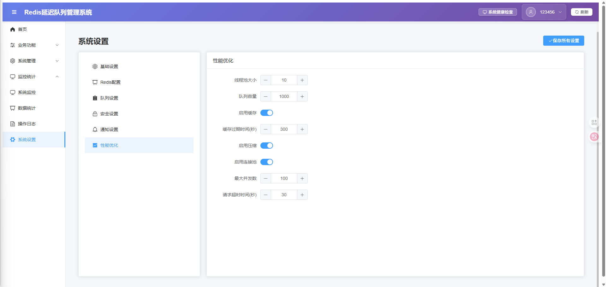

我来帮你创建一个基于Spring Boot和Redis实现的轻量级延迟队列。我们将创建以下组件：



1. 一个延迟队列服务
2. 一个示例任务处理器
3. 必要的配置类

首先，让我们创建项目的基本结构。


Ran tool
让我们创建一个新的Spring Boot项目。首先，我会创建必要的项目文件。

1. 首先创建pom.xml文件：

现在让我们创建主要的应用程序类：

接下来，让我们创建Redis配置类：

现在，让我们创建延迟队列的核心实现：

让我们创建一个示例控制器来测试延迟队列：

最后，让我们创建应用程序配置文件：

现在我已经创建了一个完整的基于Redis的延迟队列实现。这个实现具有以下特点：

1. 使用Redis的Sorted Set（ZSET）数据结构实现延迟队列
2. 支持添加延迟任务
3. 自动消费到期的任务
4. 提供REST API接口用于测试

使用方法：

1. 确保本地Redis服务器已启动
2. 运行Spring Boot应用程序
3. 使用以下API添加延迟任务：
```
POST http://localhost:8080/api/delay-queue/add?taskId=task1&delaySeconds=10
```

这个实现的工作原理：

1. 使用Redis的Sorted Set存储任务，score为任务的执行时间
2. 后台线程定期检查是否有到期的任务
3. 当任务到期时，自动执行并移除任务

你可以通过修改`RedisDelayQueue`类中的`processTask`方法来添加具体的任务处理逻辑。

要运行这个项目，你需要：

1. 安装并启动Redis服务器
2. 使用Maven构建项目：`mvn clean install`
3. 运行Spring Boot应用程序：`mvn spring-boot:run`

这个实现是轻量级的，适合用于简单的延迟任务场景。如果你需要更复杂的功能（如任务重试、任务优先级等），可以在此基础上进行扩展。
