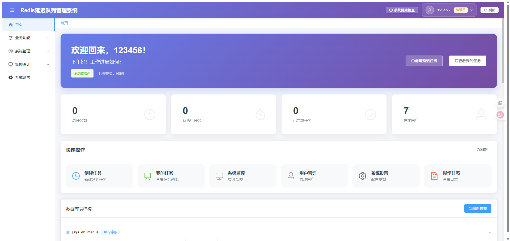
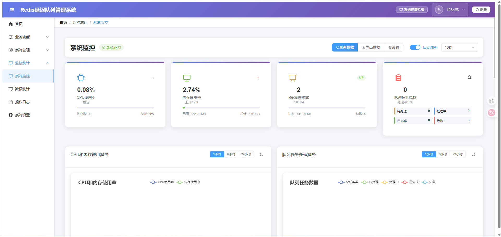
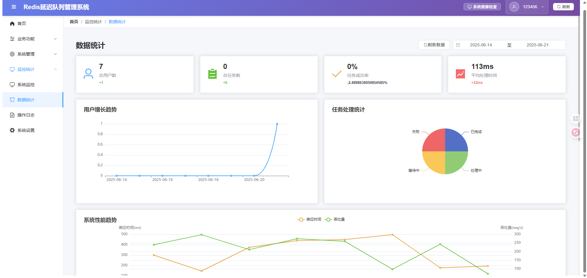
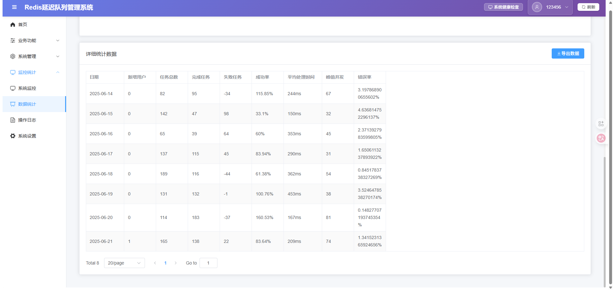

# Redis 延迟队列管理系统

基于 Spring Boot + Redis + Vue 3 的企业级延迟队列管理系统，提供完整的任务调度、监控和管理功能。

## 系统截图







## 🚀 项目特性

### 核心功能
- **延迟队列管理**：基于 Redis Sorted Set 实现的高性能延迟队列
- **任务调度**：支持任务的添加、暂停、恢复、删除等操作
- **实时监控**：系统性能监控、队列状态监控、API 统计
- **用户权限管理**：基于 RBAC 的用户权限控制
- **操作日志**：完整的操作审计日志
- **数据统计**：丰富的数据统计和可视化图表

### 技术特性
- **高性能**：Redis 作为存储引擎，支持高并发场景
- **高可用**：支持集群部署，故障自动恢复
- **易扩展**：模块化设计，支持自定义任务处理器
- **安全性**：JWT 认证，接口权限控制
- **监控完善**：系统健康检查，性能指标监控

## 🏗️ 技术架构

### 后端技术栈
- **框架**：Spring Boot 2.7.0
- **数据库**：MySQL 8.0 + Redis 6.0+
- **安全**：Spring Security + JWT
- **ORM**：Spring Data JPA + Hibernate
- **连接池**：HikariCP
- **构建工具**：Maven 3.6+
- **JDK版本**：Java 11+

### 前端技术栈
- **框架**：Vue 3.3.4
- **UI组件**：Element Plus 2.3.7
- **路由**：Vue Router 4.2.4
- **图表**：ECharts 5.4.3
- **HTTP客户端**：Axios 1.4.0
- **构建工具**：Vite 4.4.0

### 系统架构
```
┌─────────────────┐    ┌─────────────────┐    ┌─────────────────┐
│   前端 (Vue3)    │────│  后端 (Spring)   │────│   Redis 集群     │
│   - 管理界面     │    │   - REST API    │    │   - 延迟队列     │
│   - 数据可视化   │    │   - 任务调度     │    │   - 缓存存储     │
└─────────────────┘    └─────────────────┘    └─────────────────┘
                              │
                       ┌─────────────────┐
                       │   MySQL 数据库   │
                       │   - 用户数据     │
                       │   - 系统配置     │
                       │   - 操作日志     │
                       └─────────────────┘
```

## 📁 项目结构

```
redis-delay-queue/
├── src/main/java/com/example/          # 后端源码
│   ├── config/                         # 配置类
│   ├── controller/                     # 控制器
│   ├── entity/                         # 实体类
│   ├── service/                        # 服务层
│   ├── repository/                     # 数据访问层
│   ├── security/                       # 安全配置
│   ├── queue/                          # 延迟队列核心
│   └── util/                          # 工具类
├── src/main/resources/                 # 配置文件
│   ├── application.yml                 # 主配置文件
│   └── static/                        # 静态资源
├── frontend/                          # 前端项目
│   ├── src/
│   │   ├── views/                     # 页面组件
│   │   │   ├── Home.vue              # 系统首页
│   │   │   ├── DelayQueueManagement.vue  # 延迟队列管理
│   │   │   ├── SystemMonitor.vue     # 系统监控
│   │   │   ├── UserManagement.vue    # 用户管理
│   │   │   └── ...
│   │   ├── router/                    # 路由配置
│   │   └── utils/                     # 工具函数
│   ├── package.json                   # 前端依赖
│   └── vite.config.js                # 构建配置
└── pom.xml                           # Maven 配置
```

## 🛠️ 环境要求

### 开发环境
- **JDK**: 11 或更高版本
- **Maven**: 3.6 或更高版本
- **Node.js**: 16 或更高版本
- **MySQL**: 8.0 或更高版本
- **Redis**: 6.0 或更高版本

### 生产环境
- **服务器**: Linux (推荐 CentOS 7+ / Ubuntu 18.04+)
- **内存**: 最低 4GB，推荐 8GB+
- **存储**: 最低 20GB 可用空间
- **网络**: 支持外网访问

## 🚀 快速开始

### 1. 环境准备

#### 安装 MySQL
```bash
# CentOS/RHEL
sudo yum install mysql-server
sudo systemctl start mysqld
sudo systemctl enable mysqld

# Ubuntu/Debian
sudo apt update
sudo apt install mysql-server
sudo systemctl start mysql
sudo systemctl enable mysql
```

#### 安装 Redis
```bash
# CentOS/RHEL
sudo yum install redis
sudo systemctl start redis
sudo systemctl enable redis

# Ubuntu/Debian
sudo apt update
sudo apt install redis-server
sudo systemctl start redis-server
sudo systemctl enable redis-server
```

### 2. 数据库初始化

```sql
-- 创建数据库
CREATE DATABASE sys_db CHARACTER SET utf8mb4 COLLATE utf8mb4_unicode_ci;
CREATE DATABASE sys_user_db CHARACTER SET utf8mb4 COLLATE utf8mb4_unicode_ci;

-- 创建用户（可选）
CREATE USER 'delay_queue'@'%' IDENTIFIED BY 'your_password';
GRANT ALL PRIVILEGES ON sys_db.* TO 'delay_queue'@'%';
GRANT ALL PRIVILEGES ON sys_user_db.* TO 'delay_queue'@'%';
FLUSH PRIVILEGES;
```

### 3. 后端部署

#### 开发环境
```bash
# 克隆项目
git clone <repository-url>
cd redis-delay-queue

# 修改配置文件
cp src/main/resources/application.yml.example src/main/resources/application.yml
# 编辑 application.yml，配置数据库连接信息

# 编译运行
mvn clean install
mvn spring-boot:run
```

#### 生产环境
```bash
# 编译打包
mvn clean package -Dmaven.test.skip=true

# 运行应用
java -jar target/redis-delay-queue-1.0-SNAPSHOT.jar

# 或使用 systemd 服务
sudo cp scripts/redis-delay-queue.service /etc/systemd/system/
sudo systemctl daemon-reload
sudo systemctl start redis-delay-queue
sudo systemctl enable redis-delay-queue
```

### 4. 前端部署

#### 开发环境
```bash
cd frontend
npm install
npm run dev
```

#### 生产环境
```bash
cd frontend
npm install
npm run build

# 部署到 Nginx
sudo cp -r dist/* /var/www/html/
```

### 5. Nginx 配置

```nginx
server {
    listen 80;
    server_name your-domain.com;
    
    # 前端静态文件
    location / {
        root /var/www/html;
        index index.html;
        try_files $uri $uri/ /index.html;
    }
    
    # 后端 API 代理
    location /api/ {
        proxy_pass http://localhost:8090;
        proxy_set_header Host $host;
        proxy_set_header X-Real-IP $remote_addr;
        proxy_set_header X-Forwarded-For $proxy_add_x_forwarded_for;
        proxy_set_header X-Forwarded-Proto $scheme;
    }
}
```

## 📖 API 文档

### 延迟队列 API

#### 添加延迟任务
```http
POST /api/delay-queue/add
Content-Type: application/json

{
  "taskId": "task_001",
  "taskData": {
    "type": "email",
    "recipient": "user@example.com",
    "content": "Hello World"
  },
  "delaySeconds": 300,
  "priority": 1
}
```

#### 查询任务状态
```http
GET /api/delay-queue/status/{taskId}
```

#### 取消任务
```http
DELETE /api/delay-queue/cancel/{taskId}
```

### 系统监控 API

#### 获取系统状态
```http
GET /api/monitor/system
```

#### 获取队列统计
```http
GET /api/monitor/queue-stats
```

## 🔧 配置说明

### 应用配置 (application.yml)

```yaml
server:
  port: 8090                    # 服务端口

spring:
  datasource:
    primary:
      url: jdbc:mysql://localhost:3306/xx
      username: root
      password: your_password
    user:
      url: jdbc:mysql://localhost:3306/xx
      username: root
      password: your_password
      
  redis:
    host: localhost             # Redis 主机
    port: 6379                  # Redis 端口
    password:                   # Redis 密码
    database: 0                 # Redis 数据库
    
# 延迟队列配置
delay-queue:
  scan-interval: 1000          # 扫描间隔(毫秒)
  batch-size: 100              # 批处理大小
  thread-pool-size: 10         # 线程池大小
```

## 🔒 安全配置

### JWT 配置
- **密钥**: 建议使用 256 位随机密钥
- **过期时间**: 默认 24 小时
- **刷新机制**: 支持 Token 刷新

### 权限控制
- **ADMIN**: 系统管理员，拥有所有权限
- **USER**: 普通用户，只能管理自己的任务
- **GUEST**: 访客用户，只读权限

## 📊 监控指标

### 系统指标
- CPU 使用率
- 内存使用率
- 磁盘使用率
- 网络 I/O

### 业务指标
- 任务总数
- 待执行任务数
- 已完成任务数
- 失败任务数
- 平均处理时间

### Redis 指标
- 连接数
- 内存使用
- 命令执行统计
- 键空间统计

## 🚀 生产部署流程

### 1. 服务器准备
```bash
# 创建应用用户
sudo useradd -m -s /bin/bash delayqueue

# 创建应用目录
sudo mkdir -p /opt/redis-delay-queue
sudo chown delayqueue:delayqueue /opt/redis-delay-queue

# 创建日志目录
sudo mkdir -p /var/log/redis-delay-queue
sudo chown delayqueue:delayqueue /var/log/redis-delay-queue
```

### 2. 应用部署
```bash
# 上传应用包
scp target/redis-delay-queue-1.0-SNAPSHOT.jar delayqueue@server:/opt/redis-delay-queue/

# 上传配置文件
scp src/main/resources/application-prod.yml delayqueue@server:/opt/redis-delay-queue/application.yml

# 设置权限
chmod +x /opt/redis-delay-queue/redis-delay-queue-1.0-SNAPSHOT.jar
```

### 3. 系统服务配置
```bash
# 创建 systemd 服务文件
sudo tee /etc/systemd/system/redis-delay-queue.service > /dev/null <<EOF
[Unit]
Description=Redis Delay Queue Service
After=network.target mysql.service redis.service

[Service]
Type=simple
User=delayqueue
Group=delayqueue
WorkingDirectory=/opt/redis-delay-queue
ExecStart=/usr/bin/java -jar -Dspring.profiles.active=prod redis-delay-queue-1.0-SNAPSHOT.jar
Restart=always
RestartSec=10
StandardOutput=journal
StandardError=journal

[Install]
WantedBy=multi-user.target
EOF

# 启动服务
sudo systemctl daemon-reload
sudo systemctl start redis-delay-queue
sudo systemctl enable redis-delay-queue
```

### 4. 前端部署
```bash
# 构建前端
cd frontend
npm run build

# 部署到 Web 服务器
sudo cp -r dist/* /var/www/html/
sudo chown -R nginx:nginx /var/www/html/
```

### 5. 负载均衡配置
```nginx
upstream delay_queue_backend {
    server 127.0.0.1:8090 weight=1 max_fails=3 fail_timeout=30s;
    # server 127.0.0.1:8091 weight=1 max_fails=3 fail_timeout=30s;
}

server {
    listen 80;
    server_name your-domain.com;
    
    location / {
        root /var/www/html;
        index index.html;
        try_files $uri $uri/ /index.html;
    }
    
    location /api/ {
        proxy_pass http://delay_queue_backend;
        proxy_set_header Host $host;
        proxy_set_header X-Real-IP $remote_addr;
        proxy_set_header X-Forwarded-For $proxy_add_x_forwarded_for;
        proxy_set_header X-Forwarded-Proto $scheme;
        
        # 健康检查
        proxy_connect_timeout 5s;
        proxy_send_timeout 10s;
        proxy_read_timeout 10s;
    }
}
```

## 🔍 故障排查

### 常见问题

1. **应用启动失败**
   ```bash
   # 查看日志
   sudo journalctl -u redis-delay-queue -f
   
   # 检查端口占用
   sudo netstat -tlnp | grep 8090
   ```

2. **数据库连接失败**
   ```bash
   # 测试数据库连接
   mysql -h localhost -u root -p sys_db
   
   # 检查防火墙
   sudo firewall-cmd --list-ports
   ```

3. **Redis 连接失败**
   ```bash
   # 测试 Redis 连接
   redis-cli ping
   
   # 检查 Redis 状态
   sudo systemctl status redis
   ```

### 性能优化

1. **JVM 参数优化**
   ```bash
   -Xms2g -Xmx4g -XX:+UseG1GC -XX:MaxGCPauseMillis=200
   ```

2. **数据库优化**
   ```sql
   -- 添加索引
   CREATE INDEX idx_task_execute_time ON delay_tasks(execute_time);
   CREATE INDEX idx_task_status ON delay_tasks(status);
   ```

3. **Redis 优化**
   ```conf
   # redis.conf
   maxmemory 2gb
   maxmemory-policy allkeys-lru
   save 900 1
   save 300 10
   save 60 10000
   ```

## 📝 更新日志

### v1.0.0 (2024-01-15)
- ✨ 初始版本发布
- 🚀 基础延迟队列功能
- 👥 用户权限管理
- 📊 系统监控面板
- 📱 响应式前端界面

## 🤝 贡献指南

1. Fork 本仓库
2. 创建特性分支 (`git checkout -b feature/AmazingFeature`)
3. 提交更改 (`git commit -m 'Add some AmazingFeature'`)
4. 推送到分支 (`git push origin feature/AmazingFeature`)
5. 打开 Pull Request

## 📄 许可证

本项目采用 MIT 许可证 - 查看 [LICENSE](LICENSE) 文件了解详情。

## 📞 联系方式

- 项目维护者：webVueBlog

## 🙏 致谢

感谢以下开源项目的支持：
- [Spring Boot](https://spring.io/projects/spring-boot)
- [Redis](https://redis.io/)
- [Vue.js](https://vuejs.org/)
- [Element Plus](https://element-plus.org/)
- [ECharts](https://echarts.apache.org/)
